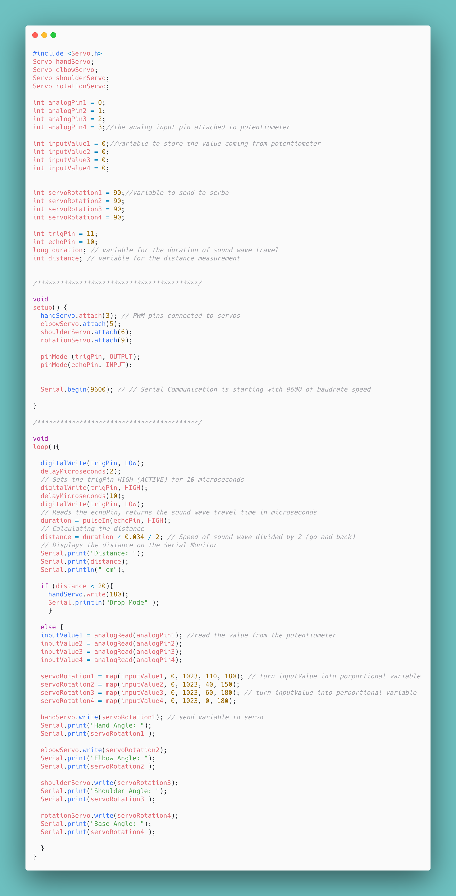

# Robot Arm
Using an Arduino Uno and Servo Motors controlled by Potentiometers, the arm can make controlled movements and complete certain tasks within the range of the movements.

| Hadley Griffin-Schmidt | Urban School of San Francisco | Mechanical Engineering | Rising Senior |
|:--:|:--:|:--:|:--:|

  
# Final Milestone
My final milestone is the physical build of the arm, its circuitry, the code, and a personal modification using an ultrasonic sensor. The arm itself is controlled by 4 potentiometers which each correspond to dc motor powering a certain joint: hand, elbow, shoulder, and base. To function, the arduino reads an input coming from the potentiometer - 0 to 1023 - using the analogRead function. Once that value has been stored, the code scales the input down to a proportional output within each motors turning radius using a function called map. In the previous milestone, the value was mapped to the range of 0 to 180 becuase the motor was allowed its full turning radius, but due to the factory build of the arm, the elbow motor, for example, is only allowed to turn between 40 to 150 degrees. So, through testing, I had to find each motors allowed range. Finally, the arduino sends the newly mapped value to the motor and thus the arm moves using the analogWrite function.  My personal modificaion was the addition of a ultrasonic sensor tothe base of the arm. The ultrasoncic sensor sends a wave and then listens for its return, measuring the amout of time it tokk to return. That duration value can then be converted to distance - cm in my case. For my project, using an if statement, I porgrammed the arm to stop reading the potentiometers if it senses an object within 20 cm and open the claw such that it would drop any object it were holding.

{:target="_blank" rel="noopener"}

# Second Milestone
For my second milestone I decided to focus on potentiometers. Noticing that the potentiometers would be essential for the final product - controlling the movement of the specficic joints of the arm - I spent my time learning how to use imputs and convert them to outputs with the arduino. To store the initial imputs, I had the arduino read the signal coming from the potentiometer using analogRead() - from 0 to 1023 - and store it in a previously defined varible. To use the analogRead() function, I had to hook up the potentiometer to one of the analog pins. Once the imput value had been stored, the next step was mapping out the value to the range of the motor. Being that the motor only rotates between 0 and 179 and the value of the potentiometer ranged from 0 to 1023, the map() funtion allowed me to scale down the values so the  turn of the potentiometer would correlate directly with the servo rotation. To store this new value I used a different "output value", also perviosuly defined. Finally, now that the value has been converted, the arduino sends the output value to the servo using [servo].write() and the servo turns accordingly.

{:target="_blank" rel="noopener"}

# First Milestone 
My first milestone was getting comfortable with Arduino, LEDs, and Servo Motors. Being new to circuitry and coding, it was important to me that before jumping into the project specs, I take a deep dive into the how and why. Starting with Blink, a simple code which blinks the led on the arduino on and off, I became comfortable with digitalWrite(), learning how to control two outputs (HIGH or LOW) to turn the LED on and off. Once comforable, I then dove into outsourcing the LED. Using digital pins, I was able to get my first introduction to circutry, spefically Ohm's Law and how to manipulate restisotrs to allow for the correct amount of current. From there, I moved on to  ~PWM pins which generate a steady rectangular wave to allow incrimental results through digital means using, for example the analogWrite() function. Rather than being either on or off, the fucntion can output anything between the allowed range (ie 0 to 255 for an LED) allowing for much more specific control. Among the new possiblites using PWM pins is the abilty to control the brightness of an LED and the rotation of a Servo Motor. Using a for() loop, I correlated two servo motors turn torwards 180 to the brightness of an LED, and its turn back to a corresponding dimming effect, using everything I have learned thus far.

{:target="_blank" rel="noopener")
